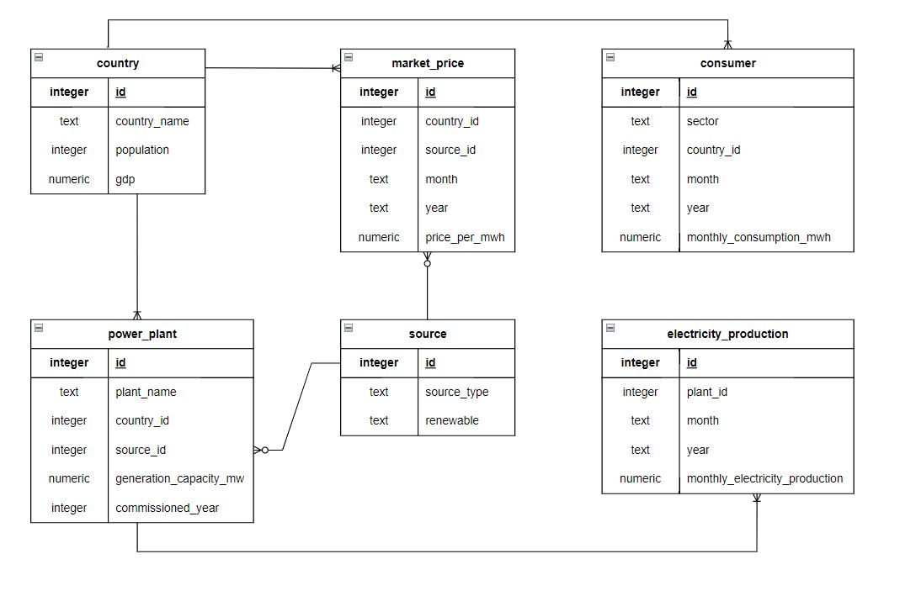

# Design Document

By Ray Vern Quah

Video overview: <https://youtu.be/-zDyCYuO3Zk>

## Introduction
The database for the CS50 SQL project aims to document and analyze the electricity market in Asia. It includes comprehensive data on countries, sources of electricity generation, power plants, electricity production, market prices, and consumer sectors. This document details the scope, functional requirements, entity representations, and relationships within the database.

## Scope

The database includes all entities necessary to facilitate the documentation of the electricity market in Asia. The scope includes:

* `Countries`: List on Asian countries.
* `Sources`: Record of source of electricity generation and their renewability.
* `Power Plants`: List of major power plants in Asia and their sources of electricity generation.
* `Electricity Productions`: Record of monthly electricity production from each power plant.
* `Market Prices`: Record of monthly price per MWh for each source type across different countries.
* `Consumers`: Record of consumer sector and their monthly electricity consumption rates.

Out of scope are elements like taxes and regulations of each country on the market price.

## Functional Requirements

The database will support:

* CRUD operations for power market data analysts, researchers and traders to manage data efficiently.
* Wide range of analyses across different Asian electricity markets, including but not limited to:  
(i) Compare electricity production from renewable and non-renewable sources to assess sustainability and efficiency. 
(ii) Analyze market price trends over time for different countries and source types to identify patterns and forecast future price trends. 
(iii) Examine consumer sector demand distribution to understand consumption behaviour and sector-specific needs.

## Representation

Entities are captured in SQLite tables with the following schema.

### Entities

The entities in the database include:

#### Countries

The `country` table includes:

* `id`, which specifies the unique ID for the Asian country as an `INTEGER`. This column thus has the `PRIMARY KEY` constraint applied.
* `country_name`, which specifies the name of Asian country as `TEXT`.
* `population`, which specifies the population of the country as an `INTEGER`.
* `gdp`, which specifies the Gross Domestic Product (GDP) of the country as `NUMERIC`.

#### Source

The `source` table includes:

* `id`, which specifies the unique ID for source type of electricity generation as an `INTEGER`. This column thus has the `PRIMARY KEY` constraint applied.
* `source_type`, which is the type of source used for electricity generation as `TEXT`. The column will only check and accept input for `Hydro`, `Coal`, `Solar`, `Nuclear`, `Gas` or `Wind`.
* `renewable`, which indicates whether the source type is renewable or non-renewable, thus `TEXT` type affinity is chosen.

#### Power Plants

The `power_plant` table includes:

* `id`, which specifies the unique ID for the power plant as an `INTEGER`. This column thus has the `PRIMARY KEY` constraint applied.
* `plant_name`, which specifies the name of power plant as `TEXT`.
* `country_id`, which is the ID of country who owns the power plant as an `INTEGER`. This column thus has the `FOREIGN KEY` constraint applied, referencing the `id` column in the `country` table to ensure data integrity.
* `source_id`, which is the ID of source type for electricity generation of the power plant as an `INTEGER`. This column thus has the `FOREIGN KEY` constraint applied, referencing the `id` column in the `source` table to ensure data integrity.
* `commissioned_year`, which specifies the year when the power plant was commissioned as an `INTEGER`.

#### Electricity Production

The `electricity_production` table includes:

* `id`, which specifies the unique ID for the electricity production of a power plant in a specific month of the year as an `INTEGER`. This column thus has the `PRIMARY KEY` constraint applied.
* `plant_id`, which is the ID of power plant producing the electricity as an `INTEGER`. This column thus has the `FOREIGN KEY` constraint applied, referencing the `id` column in the `power_plant` table to ensure data integrity.
* `month`, which specifies the month of electricity produced as `TEXT`.
* `year`, which specifies the year of electricity produced as an `INTEGER`.
* `monthly_electricity_production`, which specifies the electricity production in MWh of the month by a power plant as `NUMERIC`.

#### Market Price

The `market_price` table includes:

* `id`, which specifies the unique ID for the market price as an `INTEGER`. This column thus has the `PRIMARY KEY` constraint applied.
* `country_id`, which is the ID of country who charges the electricity price per MWh as an `INTEGER`. This column thus has the `FOREIGN KEY` constraint applied, referencing the `id` column in the `country` table to ensure data integrity.
* `source_id`, which is the ID of source type asscociated with the market price as an `INTEGER`. This column thus has the `FOREIGN KEY` constraint applied, referencing the `id` column in the `source` table to ensure data integrity.
* `month`, which specifies the market price of the month as `TEXT`.
* `year`, which specifies the market price of the year as an `INTEGER`.
* `price_per_mwh`, which specifies the market price per MWh as `NUMERIC`.

#### Consumer

The `consumer` table includes:

* `id`, which specifies the unique ID for the consumer as an `INTEGER`. This column thus has the `PRIMARY KEY` constraint applied.
* `sector`, which specifies the sector consuming the electricity. The sector will only check and accept input for `Residential`, `Industrial` or `Commercial`.
* `country_id`, which is the ID of country who owns the sector as an `INTEGER`. This column thus has the `FOREIGN KEY` constraint applied, referencing the `id` column in the `country` table to ensure data integrity.
* `month`, which specifies the month of electricity consumed by the sector as `TEXT`.
* `year`, which specifies the year of electricity consumed by the sector as an `INTEGER`.
* `monthly_consumption_mwh`, which specifies the electricity consumption in MWh in a month by the sector as `NUMERIC`.

### Relationships

The below entity relationship diagram describes the relationship among the entities in the database.

As detailed by the ER diagram:

* One country can own one or more power plants.
* Each power plant generates electricity from a specific source.
* Each country's market price for electricity can vary depending on the generation source. Market prices fluctuates over time based on supply and demand.
* The monthly electricity production by each power plant varies with time.
* Electricity generated by a country can be consumed by one or more sectors. Monthly consumption by sector varies with the demand of each sector.

## Optimizations

### Indexes Implementation

To perform market analysis and time trend studies efficiently, several key indexes have been implemented to enhance the robustness and performance of the database. The following indexes were created:

* `country` and `source` tables: Indexes on `country_name` and `source_type` respectively to facilitate quick retrieval of data based on these columns.
* `electricity_production`, `market_price`, and `consumer` tables: Indexes on `month` and `year` columns, as time-based data queries will be performed frequently for trend study.

These indexes help optimize query performance, ensuring that data retrieval and analysis operations are executed efficiently.

### Views Implementation

Views simplify complex queries and provide an accessible way to look at aggregated data, thus common query such as total electricity production by country was created as view called `total_electricity_production`.

## Limitations

Limitations of current database include:

* The schema captures data on a monthly basis which lacks finer granularity. In reality, the documentation of electricity production, consumption and market price should be in real-time hourly basis for more accurate analysis and decision-making.
* The scalability of database could be an issue when tables like `electricity_production`, `market_price` and `consumer` become larger. The database would need paritioning strategies to distribute data across multiple tables or databases.

## Disclaimers
This is my Final Project submission for CS50's Introduction to Databases with SQL.

## License
This project is licensed under the MIT License - see the [LICENSE](LICENSE) file for more details.
